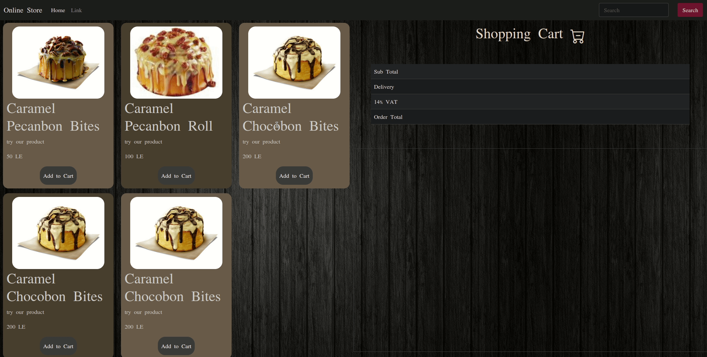

# Jquery Restaurant Menu

This is a solution of creating basic menu for restaurant system using Jquery
## Table of contents

- [Overview](#overview)
    - [Screenshot](#screenshot)
- [My process](#my-process)
    - [Built with](#built-with)
    - [Libraries](#Libraries)
- [Author](#authors)

## Overview

### GIF




<p align="right">(<a href="#top">back to top</a>)</p>

## My process
1) Clone the project

   ``` giot clone https://github.com/Hegabovic/Jquery-Resturant-Menu.git ```


<p align="right">(<a href="#top">back to top</a>)</p>

### Built with

* [JavaScript](https://www.javascript.com/)
* [Symantic HTML5 markup](https://developer.mozilla.org/en-US/docs/Glossary/HTML5)
* [CSS custom properties](https://developer.mozilla.org/en-US/docs/Web/CSS)
* [Bootstrap](https://getbootstrap.com/)
* [Jquery](https://jqueryui.com/)

<p align="right">(<a href="#top">back to top</a>)</p>

### Libraries

* [Jquery UI](https://jqueryui.com/)
* [bootstrap](https://getbootstrap.com/)


<p align="right">(<a href="#top">back to top</a>)</p>

## Authors


* LinkedIn - [Abdullah Hegab](https://www.linkedin.com/in/hegab192)


<p align="right">(<a href="#top">back to top</a>)</p>
